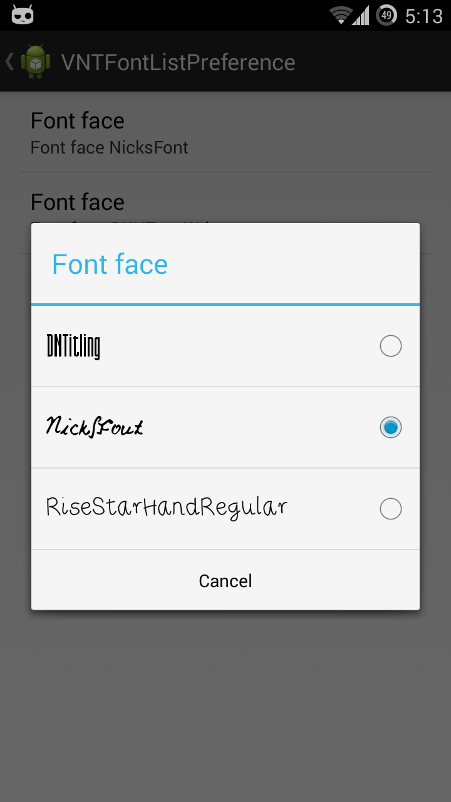

VNTFontListPreference
=====================

This is an easy to use custom preference, which opens a dialog with a list of available fonts. The selected font gets automatically saved and you are able to set the font directory as well as the defaultValue.

```xml
<com.vanniktech.vntfontlistpreference.VNTFontListPreference
    xmlns:vntfontlistpreference="http://schemas.android.com/apk/res-auto"
    android:defaultValue="@string/font_face_default_value"
    android:key="preference_font_face"
    android:title="@string/font_face"
    vntfontlistpreference:fontDirectory="@string/font_face_font_directory" />
```

`vntfontlistpreference:fontDirectory` can be something like `fonts`. Please make sure that you don't have a slash at the end. You would then to copy the `ttf` and / or `otf` files into the directory `assets/fonts`.

# Setup

**settings.gradle**

```groovy
include ':vntfontlistpreference'
project(':vntfontlistpreference').projectDir = new File(settingsDir, '/path/VNTFontListPreference/library')
```

**build.gradle**

```groovy
dependencies {
    compile project(':vntfontlistpreference')
}
```

Go to your preference XML file and insert the above mentioned XML tag. Afterwards you are good to go and can run your project!

# Get default font

```java
final SharedPreferences sharedPreferences = PreferenceManager.getDefaultSharedPreferences(this);
final String defaultFont = sharedPreferences.getString("preference_font_face", this.getString(R.string.font_face_default_value));
final Typeface typeface = Typeface.createFromAsset(this.getAssets(), font);
```

# Preview



# License

Copyright (c) 2014 Niklas Baudy

Licensed under the Apache License, Version 2.0